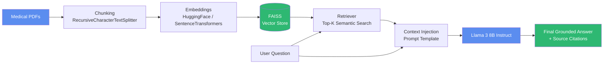
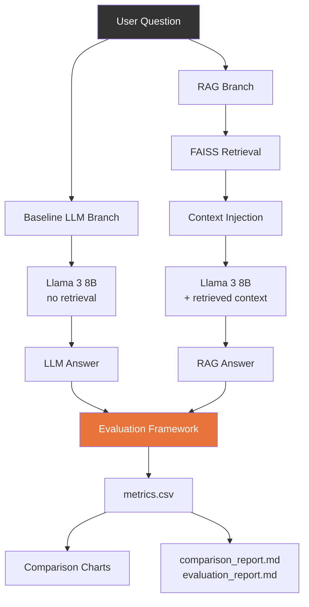

# Healthcare RAG Research: RAG vs. LLM for Evidence-Grounded Healthcare AI

A research-oriented implementation comparing a **baseline Large Language
Model (Llama 3 8B Instruct, no retrieval)** against a **Retrieval-Augmented
Generation (RAG) system** on healthcare question answering, built to
accompany and empirically reproduce the comparative framework from:

> *Tyagi, T., Rai, A. K., Saroha, K., Sharma, R., & Pramod, J.
> "Evaluating RAG and LLM Architectures for Evidence-Grounded Healthcare AI."
> Bennett University.*

The paper's survey of 20 healthcare AI studies found that RAG systems
improve factual accuracy by ~22% and reduce hallucination rates by over
60% relative to standard LLMs, at the cost of increased latency and
slightly reduced fluency. This repository operationalizes that comparison
as a runnable, end-to-end system rather than a literature survey.

---

## ⚠️ Disclaimer

This is a **research and educational tool**. It is not a medical device,
is not validated for clinical use, and must not be used to make real
patient-care decisions. All generated answers include an automated safety
disclaimer, but human clinical oversight is required for any real-world
application.

---

## Table of Contents

1. [Project Overview](#project-overview)
2. [Architecture Diagram](#architecture-diagram)
3. [Repository Structure](#repository-structure)
4. [Installation](#installation)
5. [Dataset Preparation](#dataset-preparation)
6. [Running Experiments](#running-experiments)
7. [Streamlit App](#streamlit-app)
8. [Evaluation Methodology](#evaluation-methodology)
9. [Results Interpretation](#results-interpretation)
10. [Configuration Reference](#configuration-reference)
11. [Limitations](#limitations)
12. [Citation](#citation)

---

## Project Overview

Two question-answering systems are implemented side by side, sharing the
**same underlying generative model and prompting style** so that
retrieval is isolated as the only experimental variable:

| | Baseline LLM (`llm_baseline.py`) | RAG System (`rag_pipeline.py`) |
|---|---|---|
| Knowledge source | Model's parametric (pretrained) knowledge only | Retrieved passages from ingested medical PDFs |
| Retrieval | None | Dense vector search via FAISS |
| Grounding | None | Context injected into the prompt with source citations |
| Expected strengths | Fluency, low latency | Factual accuracy, faithfulness, clinical safety |
| Expected weaknesses | Hallucination, outdated knowledge | Higher latency, dependent on retrieval quality |

An evaluation framework (`evaluation.py`) scores every response across
eight metrics drawn directly from the paper's Table I, and a Streamlit
app (`app.py`) provides an interactive interface for ingestion, querying,
side-by-side comparison, and a results dashboard.

---

## Architecture Diagram

### RAG Pipeline



### Full Comparative System



---

## Repository Structure

```
healthcare-rag-research/
│
├── README.md                    # This file
├── requirements.txt              # Pinned Python dependencies
├── app.py                        # Streamlit interface (4 pages)
├── llm_baseline.py                # Baseline LLM system (no retrieval)
├── rag_pipeline.py                # Full RAG pipeline (ingest -> retrieve -> generate)
├── evaluation.py                  # 8-metric evaluation framework + report generation
├── visualize.py                   # Chart generation (accuracy, hallucination, latency, safety)
├── prompts.py                     # All system/user/evaluation prompt templates
├── config.py                      # Central configuration (models, paths, thresholds)
├── logging_utils.py               # Shared structured logging
│
├── data/
│   ├── sample_medical_papers/    # Drop your medical PDFs here (see its README.md)
│   └── healthcare_dataset.csv     # Sample QA pairs with reference answers
│
├── vectorstore/                   # Persisted FAISS index (generated at runtime)
│
├── results/
│   ├── metrics.csv                # Per-question evaluation records
│   ├── plots/                     # Generated PNG comparison charts
│   ├── comparison_report.md       # Aggregated LLM vs RAG report
│   └── evaluation_report.md       # Detailed per-question report
│
└── notebooks/
    └── experiments.ipynb          # Batch experiment runner + analysis
```

---

## Installation

### Prerequisites

- Python 3.11
- ~8 GB free disk space for embedding models + (optionally) a local LLM
- One of the following inference backends for Llama 3 8B Instruct:
  - **[Ollama](https://ollama.com)** (recommended for local development)
  - A HuggingFace Inference Endpoint with an access token
  - A local GPU with ≥16GB VRAM (for in-process `transformers` inference)

### Steps

```bash
# 1. Clone the repository
git clone https://github.com/<your-org>/healthcare-rag-research.git
cd healthcare-rag-research

# 2. Create and activate a virtual environment
python3.11 -m venv .venv
source .venv/bin/activate        # Windows: .venv\Scripts\activate

# 3. Install dependencies
pip install -r requirements.txt

# 4a. (Recommended) Set up Ollama as the inference backend
#     Install from https://ollama.com, then:
ollama pull llama3:8b-instruct
ollama serve   # runs at http://localhost:11434 by default

# 4b. Alternatively, configure a HuggingFace Inference Endpoint:
export LLM_BACKEND=hf_inference
export HF_TOKEN=hf_xxxxxxxxxxxxxxxxxxxx
export LLM_MODEL_ID=meta-llama/Meta-Llama-3-8B-Instruct

# 5. Verify the setup
python llm_baseline.py
```

If everything is configured correctly, step 5 prints a generated answer
to a sample healthcare question along with latency and token usage.

---

## Dataset Preparation

1. **Reference QA dataset**: `data/healthcare_dataset.csv` ships with 10
   sample healthcare questions, reference answers, and expected relevant
   source documents (used for retrieval precision/recall). Extend this
   file with your own questions following the same schema:

   | column | description |
   |---|---|
   | `question` | Natural-language healthcare question |
   | `category` | Free-text clinical category (for filtering/analysis) |
   | `reference_answer` | Ground-truth answer keywords/summary used for factual-accuracy scoring |
   | `relevant_sources` | Semicolon-separated filenames of PDFs that should be retrieved for this question |

2. **Source PDFs for retrieval**: Place medical/healthcare PDFs in
   `data/sample_medical_papers/`. See the README in that folder for
   naming conventions and suggested public sources. No PDFs are bundled
   in this repository, since clinical content is typically licensed.

3. **Build the vector store**:

   ```bash
   python -c "
   from rag_pipeline import RAGPipeline
   import config, glob

   rag = RAGPipeline()
   pdfs = glob.glob(str(config.SAMPLE_PAPERS_DIR / '*.pdf'))
   rag.ingest_pdfs(pdfs)
   "
   ```

   This populates `vectorstore/` with a persisted FAISS index that all
   other entry points (`app.py`, `notebooks/experiments.ipynb`) will load
   automatically.

---

## Running Experiments

### Option A — Jupyter Notebook (batch, reproducible)

```bash
jupyter notebook notebooks/experiments.ipynb
```

Runs every question in `healthcare_dataset.csv` through both systems,
scores each response, and writes `results/metrics.csv`,
`results/comparison_report.md`, `results/evaluation_report.md`, and all
four chart PNGs in one pass.

### Option B — Command line

```bash
# Smoke-test the baseline LLM
python llm_baseline.py

# Smoke-test the RAG pipeline (requires PDFs already ingested)
python rag_pipeline.py

# Run the evaluation framework's built-in synthetic example
python evaluation.py

# Regenerate charts from the latest results/metrics.csv
python visualize.py
```

### Option C — Streamlit App (interactive)

```bash
streamlit run app.py
```

---

## Streamlit App

`app.py` provides four pages, navigable from the sidebar:

1. **📄 Upload Medical PDFs** — drag-and-drop PDF ingestion; builds and
   persists the FAISS vector store.
2. **❓ Ask Questions** — query either the baseline LLM or the RAG system
   independently; view retrieved sources for RAG answers.
3. **⚖️ Compare LLM vs RAG** — submit one question to both systems
   side-by-side, view quick metrics, and optionally save the comparison
   to `results/metrics.csv`.
4. **📊 Evaluation Dashboard** — visualize aggregated metrics from
   `results/metrics.csv`, with tabs for accuracy, hallucination, latency,
   and clinical safety, plus one-click report regeneration.

---

## Evaluation Methodology

`evaluation.py` implements the eight metrics from Table I of the source
paper:

| Metric | How it's computed |
|---|---|
| **Factual Accuracy** | Lexical overlap with a reference answer, or LLM-as-judge scoring (`use_llm_judge=True`) |
| **Faithfulness / Groundedness** | Token-level overlap between the generated answer and the retrieved context (always 0 for the no-retrieval baseline, by definition) |
| **Hallucination Rate** | Modeled as the complement of faithfulness, or directly judged by an LLM evaluator |
| **Retrieval Precision / Recall** | Standard precision/recall of retrieved source filenames against the `relevant_sources` ground truth in `healthcare_dataset.csv` (RAG only) |
| **Fluency and Coherence** | Heuristic based on sentence-length naturalness (recommended: supplement with human evaluation per the paper's methodology) |
| **Response Diversity** | Distinct-unigram ratio (unique tokens / total tokens) |
| **Computational Efficiency** | Wall-clock latency (with a retrieval/generation breakdown for RAG) and estimated token usage |
| **Clinical Safety and Reliability** | Keyword-based screen for unsafe phrases plus presence of a safety disclaimer |

All scores are normalized to **[0, 1]**, matching Section III-D of the
source paper. For higher-fidelity scoring, set `use_llm_judge=True` when
calling `evaluate_llm_response` / `evaluate_rag_response` to have the
configured LLM backend act as an impartial judge using the prompt in
`prompts.EVALUATION_SYSTEM_PROMPT`.

---

## Results Interpretation

After running experiments, three artifacts in `results/` summarize
findings:

- **`metrics.csv`** — one row per (question, system) pair; the raw data
  for any further statistical analysis.
- **`comparison_report.md`** — aggregated LLM vs. RAG averages with
  relative-gain percentages, directly comparable to Table III of the
  source paper.
- **`plots/*.png`** — four bar charts (accuracy, hallucination,
  latency, clinical safety) for quick visual inspection or inclusion in
  slides/papers.

**Expected pattern**, consistent with the source survey: RAG should show
higher factual accuracy, faithfulness, and clinical safety, and lower
hallucination, at the cost of higher latency/token usage and a small
fluency trade-off. If your results diverge substantially (e.g. RAG
fluency or safety is *worse*), check:

- Are your PDFs actually relevant to the dataset's questions?
- Is `chunk_size`/`chunk_overlap` in `config.py` appropriate for your
  documents (very large chunks reduce retrieval precision; very small
  chunks lose context)?
- Is `retrieval_config.top_k` retrieving enough — or too much —
  context?

---

## Configuration Reference

All tunables live in `config.py` and can be overridden via environment
variables without editing code:

| Env Var | Default | Purpose |
|---|---|---|
| `LLM_BACKEND` | `ollama` | `ollama` \| `hf_inference` \| `local` |
| `LLM_MODEL_ID` | `meta-llama/Meta-Llama-3-8B-Instruct` | HF model id (hf_inference/local backends) |
| `OLLAMA_MODEL_NAME` | `llama3:8b-instruct` | Ollama model tag |
| `OLLAMA_BASE_URL` | `http://localhost:11434` | Ollama server URL |
| `HF_TOKEN` | _(unset)_ | Required for `hf_inference` backend |
| `EMBEDDING_MODEL_NAME` | `sentence-transformers/all-MiniLM-L6-v2` | Embedding model for FAISS indexing |
| `CHUNK_SIZE` / `CHUNK_OVERLAP` | `800` / `120` | PDF text-splitting parameters |
| `RETRIEVAL_TOP_K` | `4` | Number of chunks retrieved per query |
| `LOG_LEVEL` | `INFO` | Python logging level |

---

## Limitations

- The bundled heuristic scorers (lexical overlap, keyword-based safety
  screen) are fast and dependency-free but are **proxies**, not
  clinical-grade evaluators. For publishable results, enable
  `use_llm_judge=True` and/or incorporate human expert review, as the
  source paper does (Section III-B-3).
- Retrieval quality is bounded by the relevance of the PDFs you ingest;
  this repository does not ship a curated medical corpus.
- Llama 3 8B Instruct is a relatively small model; absolute accuracy
  numbers will differ from the larger proprietary models referenced in
  the source paper's literature review (GPT-4, Claude 3, PaLM, etc.).
  The repository defaults to Llama 3 8B for accessibility and local
  reproducibility — swap `LLM_MODEL_ID` to compare other backbones.

---

## Citation

If you use this repository in academic work, please cite the source
paper:

```bibtex
@article{tyagi2025evaluating,
  title   = {Evaluating RAG and LLM Architectures for Evidence-Grounded Healthcare AI},
  author  = {Tyagi, Tanmay and Rai, Ashok Kumar and Saroha, Khushi and Sharma, Rohan and Pramod, Jallipalli},
  school  = {Bennett University},
  year    = {2025}
}
```
