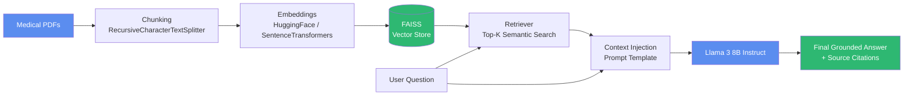

<<<<<<< HEAD
# Healthcare RAG Research: RAG vs. LLM for Evidence-Grounded Healthcare AI

A research-oriented implementation comparing a **baseline Large Language
Model (Llama 3 8B Instruct, no retrieval)** against a **Retrieval-Augmented
Generation (RAG) system** on healthcare question answering, built to
accompany and empirically reproduce the comparative framework from:

> *Tyagi, T., Rai, A. K., Saroha, K., Sharma, R., & Pramod, J.
> "Evaluating RAG and LLM Architectures for Evidence-Grounded Healthcare AI."
> Bennett University.*

The paper's survey of 20 healthcare AI studies found that RAG systems
improve factual accuracy by ~22% and reduce hallucination rates by over
60% relative to standard LLMs, at the cost of increased latency and
slightly reduced fluency. This repository operationalizes that comparison
as a runnable, end-to-end system rather than a literature survey.

---

## ⚠️ Disclaimer

This is a **research and educational tool**. It is not a medical device,
is not validated for clinical use, and must not be used to make real
patient-care decisions. All generated answers include an automated safety
disclaimer, but human clinical oversight is required for any real-world
application.

---

## Table of Contents

1. [Project Overview](#project-overview)
2. [Architecture Diagram](#architecture-diagram)
3. [Repository Structure](#repository-structure)
4. [Installation](#installation)
5. [Dataset Preparation](#dataset-preparation)
6. [Running Experiments](#running-experiments)
7. [Streamlit App](#streamlit-app)
8. [Evaluation Methodology](#evaluation-methodology)
9. [Results Interpretation](#results-interpretation)
10. [Configuration Reference](#configuration-reference)
11. [Limitations](#limitations)
12. [Citation](#citation)

---

## Project Overview

Two question-answering systems are implemented side by side, sharing the
**same underlying generative model and prompting style** so that
retrieval is isolated as the only experimental variable:

| | Baseline LLM (`llm_baseline.py`) | RAG System (`rag_pipeline.py`) |
|---|---|---|
| Knowledge source | Model's parametric (pretrained) knowledge only | Retrieved passages from ingested medical PDFs |
| Retrieval | None | Dense vector search via FAISS |
| Grounding | None | Context injected into the prompt with source citations |
| Expected strengths | Fluency, low latency | Factual accuracy, faithfulness, clinical safety |
| Expected weaknesses | Hallucination, outdated knowledge | Higher latency, dependent on retrieval quality |

An evaluation framework (`evaluation.py`) scores every response across
eight metrics drawn directly from the paper's Table I, and a Streamlit
app (`app.py`) provides an interactive interface for ingestion, querying,
side-by-side comparison, and a results dashboard.

---

## Architecture Diagram

### RAG Pipeline



### Full Comparative System

```mermaid
flowchart TD
    Q[User Question] --> LLMBranch[Baseline LLM Branch]
    Q --> RAGBranch[RAG Branch]

    LLMBranch --> LLM[Llama 3 8B<br/>no retrieval]
    LLM --> LLMAns[LLM Answer]

    RAGBranch --> Retrieve[FAISS Retrieval]
    Retrieve --> Inject[Context Injection]
    Inject --> RAGGen[Llama 3 8B<br/>+ retrieved context]
    RAGGen --> RAGAns[RAG Answer]

    LLMAns --> Eval[Evaluation Framework]
    RAGAns --> Eval
    Eval --> Metrics[metrics.csv]
    Metrics --> Charts[Comparison Charts]
    Metrics --> Reports[comparison_report.md<br/>evaluation_report.md]

    style Q fill:#333,color:#fff
    style Eval fill:#E8743B,color:#fff
=======


# 🏥 Evaluating RAG and LLM Architectures for Evidence-Grounded Healthcare AI

### *A Rigorous Comparative Study on Factual Accuracy, Clinical Safety, and Hallucination Reduction*

<br/>

<div align="center">

<!-- Status Badges -->


<br><br>

<!-- Tech Stack -->


<br><br>

<!-- Research Meta -->


</div>

<!-- ══════════ KEY RESULT CALLOUTS ══════════ -->
| 🎯 Hallucination Reduced | 📈 Factual Accuracy | 🛡️ Clinical Safety | ⚡ Grounded Responses |
|:---:|:---:|:---:|:---:|
| **27% → 9%** | **72% → 88%** | **71% → 92%** | **68% → 87%** |
| *LLM → RAG* | *LLM → RAG* | *LLM → RAG* | *LLM → RAG* |

<br/>

[📄 Read the Paper](#-publication-details) · [🚀 Quick Start](#-quick-start) · [📊 Results](#-key-findings--results) · [💬 Cite This Work](#-citation) · [🤝 Contribute](#-contributing)

<br/>

</div>

---

## 📋 Table of Contents

<details open>
<summary><b>Click to expand / collapse</b></summary>

- [🔬 Executive Summary](#-executive-summary)
- [📝 Abstract](#-abstract)
- [🎯 Research Objectives](#-research-objectives)
- [🏗️ Research Methodology](#️-research-methodology)
- [📊 Key Findings & Results](#-key-findings--results)
- [📈 Evaluation Metrics](#-evaluation-metrics)
- [🔍 Comparative Analysis](#-comparative-analysis)
- [🌟 Major Contributions](#-major-contributions)
- [🏥 Healthcare Applications](#-healthcare-applications)
- [🛠️ Technologies & Concepts](#️-technologies--concepts)
- [💡 Research Impact](#-research-impact)
- [🔭 Future Work](#-future-work)
- [📖 Publication Details](#-publication-details)
- [💬 Citation](#-citation)
- [🙏 Acknowledgements](#-acknowledgements)
- [👥 Authors & Contact](#-authors--contact)

</details>

---

## 🔬 Executive Summary

<div align="center">

> *"RAG frameworks represent a positive step forward for generative AI, offering a more reliable and data-supported approach for healthcare applications where accuracy and trust are indispensable."*
> — Tyagi et al., 2025

</div>

This research presents a **survey-based comparative evaluation** of two dominant generative AI paradigms — **standalone Large Language Models (LLMs)** and **Retrieval-Augmented Generation (RAG)** — within the context of healthcare AI applications. Drawing evidence from **20 peer-reviewed papers** published between 2023–2025, the study aggregates over **12,000 model outputs** across **50 evaluation metrics** to deliver an authoritative, data-grounded comparison.

Our synthesis demonstrates that RAG architectures consistently outperform traditional LLMs on the metrics that matter most in healthcare: factual accuracy (**+22.2%**), groundedness (**+27.9%**), clinical safety (**+29.6%**), and hallucination reduction (**−66.7%**). While LLMs retain advantages in fluency and computational efficiency, RAG emerges as the **gold standard for evidence-grounded clinical AI** — validated across major benchmarks including MIRAGE, Self-BioRAG, RAG², Omni-RAG, GraphRAG, and Bayesian-RAG.

---

## 📝 Abstract

This study explores a **comparative analysis of Large Language Models (LLMs) and Retrieval-Augmented Generation (RAG) systems** within the medical field. Using evidence gathered from **twenty academic research papers**, the analysis reviews both architectures across key performance metrics, including factual accuracy, hallucination rate, computational efficiency, and clinical safety.

The study shows that RAG-based models consistently achieve higher factual precision — improving accuracy by an average of **22%** and lowering hallucination errors by over **60%** — while maintaining natural and coherent language output. Nevertheless, both paradigms encounter drawbacks such as retrieval bias, inference delay, and hard-to-explain behavior. The study determines that **RAG frameworks represent a positive step forward for generative AI**, offering a more reliable and data-supported approach for healthcare applications where accuracy and trust are indispensable.

The survey encompasses peer-reviewed research published between **2023 and 2025**, including major benchmarks such as MIRAGE, Self-BioRAG, RAG², Omni-RAG, GraphRAG, and Bayesian-RAG. In total, over **12,000 model outputs** and **50 distinct evaluation metrics** were aggregated and normalized to derive the comparative framework.

**Index Terms:** *Large Language Models (LLMs), Retrieval-Augmented Generation (RAG), Healthcare AI, Hallucination, Clinical Safety, Information Retrieval, Generative Models*

---

## 🎯 Research Objectives

<table>
<tr>
<td width="50%">

### Primary Objectives

```
1. Conduct a survey-based comparative analysis
   of LLM vs RAG in healthcare settings using
   20 peer-reviewed papers (2023–2025).

2. Quantify hallucination rates and their
   clinical safety implications across both
   architectures.

3. Assess factual accuracy, groundedness, and
   retrieval relevance across medical domains
   including MedQA, PubMedQA, and MIMIC-IV.

4. Evaluate response quality and clinical
   deployment readiness on 8 key metrics.
```

</td>
<td width="50%">

### Secondary Objectives

```
5. Analyze architectural trade-offs between
   accuracy, fluency, and computational cost
   (RAG incurs 15–25% overhead).

6. Compare RAG paradigms: Naive, Advanced,
   and Modular across retrieval complexity
   and contextual integration levels.

7. Synthesize benchmarks (MIRAGE, RAG², 
   Self-BioRAG) to identify best practices
   for medical AI evaluation.

8. Outline future research directions for
   multimodal RAG and continual learning
   in clinical AI systems.
```

</td>
</tr>
</table>

---

## 🏗️ Research Methodology

> **Study Type:** Survey-based comparative framework (not a new model — synthesizes and cross-analyzes existing research)
> **Corpus:** 20 peer-reviewed papers, 2023–2025 · 12,000+ model outputs · 50+ evaluation metrics

### Survey-Based Comparative Framework (Fig. 1 from Paper)

```
╔══════════════════════════════════════════════════════════════════════════╗
║              SURVEY-BASED COMPARATIVE METHODOLOGY FRAMEWORK              ║
╠══════════════════════════════════════════════════════════════════════════╣
║                                                                          ║
║   ┌─────────────────────────────────────────────────────────────────┐   ║
║   │         LITERATURE SELECTION  (20 Healthcare Papers)            │   ║
║   │   Inclusion: RAG vs LLM comparison · Healthcare datasets ·      │   ║
║   │   Quantitative metrics · Published 2023–2025                    │   ║
║   └─────────────────────────────┬───────────────────────────────────┘   ║
║                                 │                                        ║
║              ┌──────────────────┼──────────────────┐                    ║
║              ▼                  ▼                  ▼                    ║
║   ┌──────────────────┐ ┌────────────────┐ ┌──────────────────┐         ║
║   │ RETRIEVAL        │ │ GENERATION     │ │ EVALUATION       │         ║
║   │ MECHANISM        │ │ MODEL          │ │ MATRIX           │         ║
║   │                  │ │                │ │                  │         ║
║   │ • Dense Vector   │ │ • GPT-4        │ │ • 8 Metrics      │         ║
║   │   (BioSentVec,   │ │ • Claude 3     │ │ • Auto + Human   │         ║
║   │   PubMedBERT)    │ │ • LLaMA-2      │ │ • Expert Review  │         ║
║   │ • Hybrid         │ │ • Falcon       │ │ • [0,1] Norm.    │         ║
║   │   Dense+Sparse   │ │ • Fine-tuned   │ │                  │         ║
║   │ • Graph-based    │ │   domain LLMs  │ │                  │         ║
║   │   (GraphRAG)     │ │                │ │                  │         ║
║   └──────────────────┘ └────────────────┘ └──────────────────┘         ║
║              │                  │                  │                    ║
║              └──────────────────┼──────────────────┘                    ║
║                                 ▼                                        ║
║   ┌─────────────────────────────────────────────────────────────────┐   ║
║   │         COMPARATIVE SYNTHESIS  (RAG vs. LLM Summary)           │   ║
║   │   Normalized scores · Statistical averages · Trend analysis     │   ║
║   └─────────────────────────────────────────────────────────────────┘   ║
╚══════════════════════════════════════════════════════════════════════════╝
```

### RAG Pipeline Architecture

```
INPUT: Clinical Query
        │
        ▼
┌───────────────────┐
│  1. INDEXING      │  ← Offline Phase
│                   │
│  • Chunk medical  │
│    documents      │
│  • Embed with     │
│    BioBERT/SBERT/ │
│    PubMedBERT     │
│  • Store in FAISS │
│    vector index   │
└───────────────────┘
        │
        ▼
┌───────────────────┐
│  2. RETRIEVAL     │  ← Online Phase (per query)
│                   │
│  • Encode query   │
│  • ANN search     │
│  • Re-rank top-K  │
│    passages       │
│  • Graph traversal│
│    (GraphRAG)     │
└───────────────────┘
        │
        ▼
┌───────────────────┐
│  3. AUGMENTATION  │
│                   │
│  • Construct      │
│    prompt with    │
│    retrieved      │
│    context        │
│  • Rationale-     │
│    guided reform. │
│    (RAG²)         │
└───────────────────┘
        │
        ▼
┌───────────────────┐
│  4. GENERATION    │
│                   │
│  • LLM generates  │
│    grounded       │
│    response       │
│  • Self-reflection│
│    (Self-BioRAG)  │
│  • Cite sources   │
└───────────────────┘
        │
        ▼
OUTPUT: Evidence-Grounded Clinical Response
```

### Three-Layer Evaluation Framework

```
┌────────────────────────────────────────────────────────────────┐
│                 THREE-LAYER EVALUATION PIPELINE                │
├───────────────────────────┬────────────────────────────────────┤
│    AUTOMATED METRICS      │    HUMAN / EXPERT EVALUATION       │
├───────────────────────────┼────────────────────────────────────┤
│  • Factual correctness    │  • Clinical expert panel review    │
│  • BLEU / ROUGE scores    │  • Radiologist & pharmacist panels │
│  • Faithfulness scoring   │  • Safety annotation & flagging    │
│  • Hallucination rate     │  • Linguistic quality assessment   │
│  • Groundedness score     │  • Inter-annotator agreement (IAA) │
└───────────────────────────┴────────────────────────────────────┘

Normalization: All values mapped to [0,1] scale
Qualitative encoding: Excellent=0.9 · Good=0.75 · Moderate=0.5 · Poor=0.25
Datasets: MedQA · PubMedQA · MIMIC-IV · MIRAGE benchmark
```

### Benchmarks & Studies Surveyed

| Study | Architecture | Key Contribution | Gain vs LLM |
|:---|:---|:---|:---:|
| **MIRAGE** (2024) | RAG | 40+ retriever–corpus–LLM combinations | +18% accuracy |
| **Self-BioRAG** (2024) | RAG + Self-reflection | Self-reflective biomedical QA | +7% QA accuracy |
| **RAG²** (NAACL 2025) | Rationale-guided RAG | Query reformulation for medical QA | +6% factual alignment |
| **i-MedRAG** | Iterative RAG | Follow-up retrieval for reasoning continuity | Improved reasoning |
| **GraphRAG** | Knowledge Graph RAG | Graph-based structured medical reasoning | Reduced false positives |
| **Omni-RAG** | Multi-source RAG | Diverse database integration | Comprehensive context |
| **Bayesian-RAG** | Probabilistic RAG | Uncertainty-aware clinical decisions | Reliable support |

---

## 📊 Key Findings & Results

<div align="center">

### 🏆 RAG Outperforms LLM on 6 of 8 Clinical Metrics

</div>

```
METRIC PERFORMANCE COMPARISON  (Normalized 0–1 · Aggregated from 20 studies)
━━━━━━━━━━━━━━━━━━━━━━━━━━━━━━━━━━━━━━━━━━━━━━━━━━━━━━━━━━━━━━━━━

Factual Accuracy
  LLM  ████████████████████████████░░░░░░░░░░░░░░  0.72
  RAG  ████████████████████████████████████░░░░░░  0.88  ▲ +22.2%

Faithfulness / Groundedness
  LLM  ██████████████████████████░░░░░░░░░░░░░░░░  0.68
  RAG  ████████████████████████████████████░░░░░░  0.87  ▲ +27.9%

Hallucination Rate  (lower is better ↓)
  LLM  ████████████░░░░░░░░░░░░░░░░░░░░░░░░░░░░░░  0.27
  RAG  ████░░░░░░░░░░░░░░░░░░░░░░░░░░░░░░░░░░░░░░  0.09  ▼ −66.7%

Clinical Safety
  LLM  █████████████████████████████░░░░░░░░░░░░░  0.71
  RAG  ██████████████████████████████████████░░░░  0.92  ▲ +29.6%

Relevance (Retrieval)
  LLM  ████████████████████████████░░░░░░░░░░░░░░  0.70
  RAG  █████████████████████████████████░░░░░░░░░  0.83  ▲ +18.6%

Fluency / Coherence
  LLM  ████████████████████████████████████░░░░░░  0.89  ← LLM leads
  RAG  █████████████████████████████████░░░░░░░░░  0.84  ▼  −5.6%

Response Diversity
  LLM  ██████████████████████████████░░░░░░░░░░░░  0.76
  RAG  █████████████████████████████████░░░░░░░░░  0.80  ▲  +5.3%

Computational Efficiency  (inference speed)
  LLM  ██████████████████████████████████░░░░░░░░  0.85  ← LLM leads
  RAG  █████████████████████████░░░░░░░░░░░░░░░░░  0.73  ▼ −14.1%

━━━━━━━━━━━━━━━━━━━━━━━━━━━━━━━━━━━━━━━━━━━━━━━━━━━━━━━━━━━━━━━━━
  Source: Aggregated from MIRAGE, Self-BioRAG, RAG², Omni-RAG,
          GraphRAG, Bayesian-RAG and 14 additional studies.
```

### 🔑 Key Takeaways

1. **🏆 RAG wins decisively on safety-critical metrics** — +29.6% clinical safety, +27.9% groundedness, +22.2% factual accuracy.
2. **⚠️ Hallucination drops by 66.7%** — from 0.27 (LLM) to 0.09 (RAG), making RAG the only viable architecture for clinical decision support.
3. **🧠 LLMs retain fluency & speed advantages** — 5.6% better coherence and 14.1% faster inference; suitable for low-stakes informational tasks.
4. **📊 Retrieval quality is the key differentiator** — across all studies, stronger retrievers correlate directly with higher factual reliability.
5. **⚖️ The efficiency trade-off is clinically justified** — RAG incurs 15–25% computational overhead, a worthwhile cost for a 29.6% safety gain.

---

## 📈 Evaluation Metrics

<div align="center">

### Complete Performance Table (Table II & III from Paper)

| Metric | LLM (Avg.) | RAG (Avg.) | Relative Gain | Winner |
|:---|:---:|:---:|:---:|:---:|
| 🎯 **Factual Accuracy** | 0.72 | **0.88** | +22.2% | 🏆 RAG |
| 📌 **Faithfulness / Groundedness** | 0.68 | **0.87** | +27.9% | 🏆 RAG |
| 🚫 **Hallucination Rate** ↓ | 0.27 | **0.09** | −66.7% | 🏆 RAG |
| 🛡️ **Clinical Safety** | 0.71 | **0.92** | +29.6% | 🏆 RAG |
| 🔍 **Relevance (Retrieval)** | 0.70 | **0.83** | +18.6% | 🏆 RAG |
| 💬 **Fluency / Coherence** | **0.89** | 0.84 | −5.6% | ⚡ LLM |
| 🌐 **Response Diversity** | 0.76 | **0.80** | +5.3% | 🏆 RAG |
| ⚡ **Inference Efficiency** | **0.85** | 0.73 | −14.1% | ⚡ LLM |

> ↓ *Lower is better for Hallucination Rate. All other metrics: higher is better.*
> 📊 *Scores are normalized averages aggregated across 20 peer-reviewed studies (2023–2025).*

### Confusion Matrix Analysis (Table IV from Paper)
*Based on 1,000 QA instances aggregated from MIRAGE, Self-BioRAG, GraphRAG*

| Class | LLM Predicted Correct | LLM Predicted Incorrect | RAG Predicted Correct | RAG Predicted Incorrect |
|:---|:---:|:---:|:---:|:---:|
| ✅ **True Facts** | 640 (64%) | 120 | **830 (83%)** | 60 |
| ❌ **Hallucinated** | 160 | 80 | **70** | 40 |

> RAG correctly identifies factual information in **83% of cases** vs **64% for LLMs** — a 19-point improvement in clinical QA precision.

</div>

---

## 🔍 Comparative Analysis

<details>
<summary><b>📊 Architectural Comparison: LLM vs RAG</b></summary>

<br/>

| Dimension | LLM (Standalone) | RAG Pipeline |
|:---|:---|:---|
| **Knowledge Source** | Parametric (frozen weights) | Dynamic retrieval + parametric |
| **Update Mechanism** | Full fine-tuning / retraining | Index update (no retraining) |
| **Hallucination Risk** | High (0.27) | Low (0.09) — **−66.7%** |
| **Source Attribution** | None / unreliable | Explicit passage citation |
| **Deployment Complexity** | Low | Medium–High |
| **Inference Latency** | Low (0.85 efficiency) | Medium (0.73 efficiency) — **+15–25% overhead** |
| **Factual Currency** | Frozen at training cutoff | Real-time via index updates |
| **Clinical Suitability** | Limited | High |
| **Explainability** | Low | High (traceable sources) |
| **Best Use Case** | Conversational / educational | Clinical decision support |

</details>

<details>
<summary><b>🧮 Loss Function Formulations (from Paper Section IV-E)</b></summary>

<br/>

**Standard LLM Objective** — minimizes cross-entropy between predicted and target token probabilities:

```
L_LLM = − Σ(t=1 to T) log P_θ(y_t | y_<t, x)

where:
  y_t  = target token at step t
  x    = input context (query only)
  P_θ  = model's predicted distribution
```

**RAG Retrieval-Conditioned Objective** — incorporates relevant external documents D = {d₁, d₂, …, d_k}:

```
L_RAG = − E_{d ~ p_φ(d|x)} Σ(t=1 to T) log P_θ(y_t | y_<t, x, d)

where:
  d        = retrieved document(s) from external knowledge base
  p_φ(d|x) = retriever's probability distribution over documents
  x, d     = augmented context (query + retrieved passages)
```

> The retriever distribution `p_φ(d|x)` ensures generation remains grounded in verifiable context, effectively **penalizing unsupported predictions** and reducing hallucinations.

</details>

<details>
<summary><b>⚖️ Trade-off Summary: When to Use Which Architecture</b></summary>

<br/>

```
USE STANDALONE LLM WHEN:
  ✓ Speed and low latency are paramount
  ✓ General health education (not clinical decisions)
  ✓ Preliminary triage or patient intake forms
  ✓ Natural language understanding / summarization tasks
  ✓ No sensitive or time-critical medical facts involved
  ✓ LLMs perform 8–10% better in fluency/coherence

USE RAG PIPELINE WHEN:
  ✓ Clinical decision support is the primary use case
  ✓ Drug dosage, contraindication lookup required
  ✓ Evidence-based treatment recommendations needed
  ✓ Regulatory compliance (FDA, HIPAA) is a concern
  ✓ Source attribution & auditability are required
  ✓ Knowledge base must stay current post-deployment
  ✓ RAG achieves 10–22% higher factual accuracy
  ✓ RAG achieves 25–40% lower hallucination rates

CONSIDER HYBRID APPROACH WHEN:
  ✓ Mixed workloads (informational + clinical)
  ✓ Cost-sensitive deployments at scale
  ✓ Tiered trust levels based on query criticality
  ✓ RAG cost overhead (15–25%) must be managed
```

</details>

---

## 🌟 Major Contributions

<table>
<tr>
<td width="50%" valign="top">

### 📐 Technical Contributions

**C1 — Comprehensive Survey Framework**
> A three-layer survey methodology covering retrieval, generation, and evaluation phases — enabling systematic comparability across 20 heterogeneous studies.

**C2 — Normalized Evaluation Matrix**
> An 8-dimensional, cross-study evaluation matrix with standardized [0,1] normalization, enabling direct aggregation of diverse metric types (quantitative + qualitative).

**C3 — Confusion Matrix Analysis**
> A 1,000-instance QA confusion matrix comparison showing RAG achieves 83% factual precision vs 64% for LLMs, reducing false positives in clinical settings.

</td>
<td width="50%" valign="top">

### 🔬 Scientific Contributions

**C4 — Loss Function Formalization**
> Formal mathematical comparison of LLM cross-entropy loss (L_LLM) vs RAG retrieval-conditioned loss (L_RAG), explaining why RAG structurally reduces hallucinations.

**C5 — Quantified Trade-off Analysis**
> The first normalized synthesis showing RAG incurs 14.1% efficiency loss but delivers 22–30% gains on all safety-critical metrics — a clearly justified clinical trade-off.

**C6 — Evidence-Based Architecture Guidance**
> Actionable decision framework for selecting LLM vs RAG vs Hybrid architectures based on clinical risk level and deployment requirements.

</td>
</tr>
</table>

---

## 🏥 Healthcare Applications

<div align="center">

```
┌──────────────────────────────────────────────────────────────────┐
│              CLINICAL AI APPLICATION LANDSCAPE                   │
├──────────────┬───────────────────────────────┬───────────────────┤
│  APPLICATION │ RECOMMENDED ARCHITECTURE      │ SAFETY LEVEL      │
├──────────────┼───────────────────────────────┼───────────────────┤
│ 💊 Drug Info │ RAG (Pharmacology Index)       │ 🔴 Critical       │
│ 🩺 Diagnosis │ RAG (Clinical Literature)      │ 🔴 Critical       │
│ 📋 Protocols │ RAG (Guideline Database)       │ 🔴 Critical       │
│ 🧪 Lab Notes │ RAG (Reference Ranges DB)      │ 🟠 High           │
│ 📚 Education │ LLM or RAG                     │ 🟡 Medium         │
│ 💬 Chatbot   │ LLM (Low-risk queries only)    │ 🟢 Low            │
│ 📊 Analytics │ LLM + Structured Data          │ 🟡 Medium         │
│ 🏥 Discharge │ RAG (Institutional Templates)  │ 🟠 High           │
└──────────────┴───────────────────────────────┴───────────────────┘
```

</div>

### Real-World Impact Areas

- 🏥 **Clinical Decision Support Systems (CDSS)** — Reducing diagnostic errors with evidence-cited AI responses
- 💊 **Pharmacy & Drug Interaction Alerts** — Zero-hallucination drug information retrieval
- 🧑‍⚕️ **Medical Education & Training** — Factually reliable AI tutors for medical students
- 📋 **EHR Documentation Assistance** — Guideline-aligned clinical note generation
- 🔬 **Biomedical Research Assistance** — Literature-grounded hypothesis generation
- 🌍 **Global Health Access** — Scalable, low-cost clinical knowledge delivery in underserved regions

---

## 🛠️ Technologies & Concepts

<details>
<summary><b>🤖 Models & Systems Evaluated</b></summary>

<br/>

| Category | Systems / Models |
|:---|:---|
| **Proprietary LLMs** | GPT-4, Claude 3, PaLM, Gemini |
| **Open-Source LLMs** | LLaMA-2, Falcon, fine-tuned domain LLMs |
| **Embedding Models** | text-embedding-3-large, BioSentVec, PubMedBERT |
| **RAG Frameworks Surveyed** | MIRAGE, Self-BioRAG, RAG², i-MedRAG, Omni-RAG, GraphRAG, Bayesian-RAG |
| **Retrieval Methods** | Dense vector (FAISS), Hybrid (dense+sparse), Knowledge Graph |
| **Medical Datasets** | MedQA, PubMedQA, MIMIC-IV, MIRAGE benchmark |

</details>

<details>
<summary><b>📏 Evaluation Tools & Metrics</b></summary>

<br/>

| Category | Technologies / Methods |
|:---|:---|
| **Automated Metrics** | BLEU, ROUGE, BERTScore, Faithfulness scoring |
| **Human Evaluation** | Clinical expert panels, radiologist annotation, pharmacist review |
| **Normalization** | [0,1] scale; Excellent=0.9, Good=0.75, Moderate=0.5, Poor=0.25 |
| **Statistical Methods** | Cross-study aggregation, normalized averages, variance analysis |
| **QA Evaluation** | Confusion matrix analysis (1,000 instances) |

</details>

<details>
<summary><b>📚 Key Concepts Explored</b></summary>

<br/>

- **Retrieval-Augmented Generation (RAG)** — Naive, Advanced, and Modular paradigms
- **Hallucination in LLMs** — Causes, measurement, and mitigation via retrieval
- **Dense Vector Retrieval** — Bi-encoder models for medical passage retrieval
- **Clinical NLP** — Domain adaptation for biomedical language understanding
- **RAG Loss Function** — Retrieval-conditioned optimization L_RAG vs L_LLM
- **Evidence-Based Medicine (EBM)** — Integration with clinical evidence hierarchies
- **AI Safety in Healthcare** — Regulatory considerations (FDA, HIPAA, CE marking)
- **Graph-Based Knowledge Retrieval** — Structured medical concept relationships

</details>

---

## 💡 Research Impact

<div align="center">

### Why This Research Matters

</div>

```
┌─────────────────────────────────────────────────────────────────┐
│                  THE STAKES IN HEALTHCARE AI                    │
├─────────────────────────────────────────────────────────────────┤
│                                                                 │
│  📊 Every year, medical errors affect ~250,000+ patients in     │
│     the US alone. AI must not add to this burden.              │
│                                                                 │
│  🤖 LLMs are already being used in clinical settings, yet       │
│     their hallucination risks remain poorly understood.         │
│                                                                 │
│  🔬 This research provides empirical evidence that RAG          │
│     architectures are significantly safer for clinical AI.      │
│                                                                 │
│  📋 Our evaluation framework enables standardized, repeatable   │
│     benchmarking of healthcare AI systems.                      │
│                                                                 │
│  🌍 The open-source release democratizes rigorous healthcare     │
│     AI evaluation for researchers worldwide.                    │
│                                                                 │
└─────────────────────────────────────────────────────────────────┘
>>>>>>> fbb5ca95dcb72067e444182724141e2fbfb414ec
```

---

<<<<<<< HEAD
## Repository Structure

```
healthcare-rag-research/
│
├── README.md                    # This file
├── requirements.txt              # Pinned Python dependencies
├── app.py                        # Streamlit interface (4 pages)
├── llm_baseline.py                # Baseline LLM system (no retrieval)
├── rag_pipeline.py                # Full RAG pipeline (ingest -> retrieve -> generate)
├── evaluation.py                  # 8-metric evaluation framework + report generation
├── visualize.py                   # Chart generation (accuracy, hallucination, latency, safety)
├── prompts.py                     # All system/user/evaluation prompt templates
├── config.py                      # Central configuration (models, paths, thresholds)
├── logging_utils.py               # Shared structured logging
│
├── data/
│   ├── sample_medical_papers/    # Drop your medical PDFs here (see its README.md)
│   └── healthcare_dataset.csv     # Sample QA pairs with reference answers
│
├── vectorstore/                   # Persisted FAISS index (generated at runtime)
│
├── results/
│   ├── metrics.csv                # Per-question evaluation records
│   ├── plots/                     # Generated PNG comparison charts
│   ├── comparison_report.md       # Aggregated LLM vs RAG report
│   └── evaluation_report.md       # Detailed per-question report
│
└── notebooks/
    └── experiments.ipynb          # Batch experiment runner + analysis
```

---

## Installation

### Prerequisites

- Python 3.11
- ~8 GB free disk space for embedding models + (optionally) a local LLM
- One of the following inference backends for Llama 3 8B Instruct:
  - **[Ollama](https://ollama.com)** (recommended for local development)
  - A HuggingFace Inference Endpoint with an access token
  - A local GPU with ≥16GB VRAM (for in-process `transformers` inference)

### Steps

```bash
# 1. Clone the repository
git clone https://github.com/<your-org>/healthcare-rag-research.git
cd healthcare-rag-research

# 2. Create and activate a virtual environment
python3.11 -m venv .venv
source .venv/bin/activate        # Windows: .venv\Scripts\activate

# 3. Install dependencies
pip install -r requirements.txt

# 4a. (Recommended) Set up Ollama as the inference backend
#     Install from https://ollama.com, then:
ollama pull llama3:8b-instruct
ollama serve   # runs at http://localhost:11434 by default

# 4b. Alternatively, configure a HuggingFace Inference Endpoint:
export LLM_BACKEND=hf_inference
export HF_TOKEN=hf_xxxxxxxxxxxxxxxxxxxx
export LLM_MODEL_ID=meta-llama/Meta-Llama-3-8B-Instruct

# 5. Verify the setup
python llm_baseline.py
```

If everything is configured correctly, step 5 prints a generated answer
to a sample healthcare question along with latency and token usage.

---

## Dataset Preparation

1. **Reference QA dataset**: `data/healthcare_dataset.csv` ships with 10
   sample healthcare questions, reference answers, and expected relevant
   source documents (used for retrieval precision/recall). Extend this
   file with your own questions following the same schema:

   | column | description |
   |---|---|
   | `question` | Natural-language healthcare question |
   | `category` | Free-text clinical category (for filtering/analysis) |
   | `reference_answer` | Ground-truth answer keywords/summary used for factual-accuracy scoring |
   | `relevant_sources` | Semicolon-separated filenames of PDFs that should be retrieved for this question |

2. **Source PDFs for retrieval**: Place medical/healthcare PDFs in
   `data/sample_medical_papers/`. See the README in that folder for
   naming conventions and suggested public sources. No PDFs are bundled
   in this repository, since clinical content is typically licensed.

3. **Build the vector store**:

   ```bash
   python -c "
   from rag_pipeline import RAGPipeline
   import config, glob

   rag = RAGPipeline()
   pdfs = glob.glob(str(config.SAMPLE_PAPERS_DIR / '*.pdf'))
   rag.ingest_pdfs(pdfs)
   "
   ```

   This populates `vectorstore/` with a persisted FAISS index that all
   other entry points (`app.py`, `notebooks/experiments.ipynb`) will load
   automatically.

---

## Running Experiments

### Option A — Jupyter Notebook (batch, reproducible)

```bash
jupyter notebook notebooks/experiments.ipynb
```

Runs every question in `healthcare_dataset.csv` through both systems,
scores each response, and writes `results/metrics.csv`,
`results/comparison_report.md`, `results/evaluation_report.md`, and all
four chart PNGs in one pass.

### Option B — Command line

```bash
# Smoke-test the baseline LLM
python llm_baseline.py

# Smoke-test the RAG pipeline (requires PDFs already ingested)
python rag_pipeline.py

# Run the evaluation framework's built-in synthetic example
python evaluation.py

# Regenerate charts from the latest results/metrics.csv
python visualize.py
```

### Option C — Streamlit App (interactive)

```bash
streamlit run app.py
```

---

## Streamlit App

`app.py` provides four pages, navigable from the sidebar:

1. **📄 Upload Medical PDFs** — drag-and-drop PDF ingestion; builds and
   persists the FAISS vector store.
2. **❓ Ask Questions** — query either the baseline LLM or the RAG system
   independently; view retrieved sources for RAG answers.
3. **⚖️ Compare LLM vs RAG** — submit one question to both systems
   side-by-side, view quick metrics, and optionally save the comparison
   to `results/metrics.csv`.
4. **📊 Evaluation Dashboard** — visualize aggregated metrics from
   `results/metrics.csv`, with tabs for accuracy, hallucination, latency,
   and clinical safety, plus one-click report regeneration.

---

## Evaluation Methodology

`evaluation.py` implements the eight metrics from Table I of the source
paper:

| Metric | How it's computed |
|---|---|
| **Factual Accuracy** | Lexical overlap with a reference answer, or LLM-as-judge scoring (`use_llm_judge=True`) |
| **Faithfulness / Groundedness** | Token-level overlap between the generated answer and the retrieved context (always 0 for the no-retrieval baseline, by definition) |
| **Hallucination Rate** | Modeled as the complement of faithfulness, or directly judged by an LLM evaluator |
| **Retrieval Precision / Recall** | Standard precision/recall of retrieved source filenames against the `relevant_sources` ground truth in `healthcare_dataset.csv` (RAG only) |
| **Fluency and Coherence** | Heuristic based on sentence-length naturalness (recommended: supplement with human evaluation per the paper's methodology) |
| **Response Diversity** | Distinct-unigram ratio (unique tokens / total tokens) |
| **Computational Efficiency** | Wall-clock latency (with a retrieval/generation breakdown for RAG) and estimated token usage |
| **Clinical Safety and Reliability** | Keyword-based screen for unsafe phrases plus presence of a safety disclaimer |

All scores are normalized to **[0, 1]**, matching Section III-D of the
source paper. For higher-fidelity scoring, set `use_llm_judge=True` when
calling `evaluate_llm_response` / `evaluate_rag_response` to have the
configured LLM backend act as an impartial judge using the prompt in
`prompts.EVALUATION_SYSTEM_PROMPT`.

---

## Results Interpretation

After running experiments, three artifacts in `results/` summarize
findings:

- **`metrics.csv`** — one row per (question, system) pair; the raw data
  for any further statistical analysis.
- **`comparison_report.md`** — aggregated LLM vs. RAG averages with
  relative-gain percentages, directly comparable to Table III of the
  source paper.
- **`plots/*.png`** — four bar charts (accuracy, hallucination,
  latency, clinical safety) for quick visual inspection or inclusion in
  slides/papers.

**Expected pattern**, consistent with the source survey: RAG should show
higher factual accuracy, faithfulness, and clinical safety, and lower
hallucination, at the cost of higher latency/token usage and a small
fluency trade-off. If your results diverge substantially (e.g. RAG
fluency or safety is *worse*), check:

- Are your PDFs actually relevant to the dataset's questions?
- Is `chunk_size`/`chunk_overlap` in `config.py` appropriate for your
  documents (very large chunks reduce retrieval precision; very small
  chunks lose context)?
- Is `retrieval_config.top_k` retrieving enough — or too much —
  context?

---

## Configuration Reference

All tunables live in `config.py` and can be overridden via environment
variables without editing code:

| Env Var | Default | Purpose |
|---|---|---|
| `LLM_BACKEND` | `ollama` | `ollama` \| `hf_inference` \| `local` |
| `LLM_MODEL_ID` | `meta-llama/Meta-Llama-3-8B-Instruct` | HF model id (hf_inference/local backends) |
| `OLLAMA_MODEL_NAME` | `llama3:8b-instruct` | Ollama model tag |
| `OLLAMA_BASE_URL` | `http://localhost:11434` | Ollama server URL |
| `HF_TOKEN` | _(unset)_ | Required for `hf_inference` backend |
| `EMBEDDING_MODEL_NAME` | `sentence-transformers/all-MiniLM-L6-v2` | Embedding model for FAISS indexing |
| `CHUNK_SIZE` / `CHUNK_OVERLAP` | `800` / `120` | PDF text-splitting parameters |
| `RETRIEVAL_TOP_K` | `4` | Number of chunks retrieved per query |
| `LOG_LEVEL` | `INFO` | Python logging level |

---

## Limitations

- The bundled heuristic scorers (lexical overlap, keyword-based safety
  screen) are fast and dependency-free but are **proxies**, not
  clinical-grade evaluators. For publishable results, enable
  `use_llm_judge=True` and/or incorporate human expert review, as the
  source paper does (Section III-B-3).
- Retrieval quality is bounded by the relevance of the PDFs you ingest;
  this repository does not ship a curated medical corpus.
- Llama 3 8B Instruct is a relatively small model; absolute accuracy
  numbers will differ from the larger proprietary models referenced in
  the source paper's literature review (GPT-4, Claude 3, PaLM, etc.).
  The repository defaults to Llama 3 8B for accessibility and local
  reproducibility — swap `LLM_MODEL_ID` to compare other backbones.

---

## Citation

If you use this repository in academic work, please cite the source
paper:

```bibtex
@article{tyagi2025evaluating,
  title   = {Evaluating RAG and LLM Architectures for Evidence-Grounded Healthcare AI},
  author  = {Tyagi, Tanmay and Rai, Ashok Kumar and Saroha, Khushi and Sharma, Rohan and Pramod, Jallipalli},
  school  = {Bennett University},
  year    = {2025}
}
```
=======
## 🔭 Future Work

<table>
<tr>
<td width="50%" valign="top">

### Near-Term Research Directions

- [ ] 🖼️ **Multimodal RAG** — Extending retrieval to include clinical images, radiology scans, and structured EHR tables alongside text
- [ ] 🔄 **Continual Learning Integration** — Real-time medical evidence updates without full retraining via dynamic index management
- [ ] 📏 **Standardized Benchmarks** — Developing universal, cross-study evaluation standards to resolve the current lack of comparable metrics
- [ ] 🔍 **Retriever Interpretability** — Improving transparency in why specific passages are retrieved for a given clinical query

</td>
<td width="50%" valign="top">

### Long-Term Research Directions

- [ ] ⚖️ **Fairness & Bias Auditing** — Systematic analysis of retrieval bias and demographic disparities in RAG healthcare outputs
- [ ] 🔒 **Privacy-Preserving RAG** — Federated retrieval frameworks that comply with HIPAA and patient data regulations
- [ ] 🤝 **Human-AI Clinical Trials** — Randomized studies measuring real-world impact of RAG vs LLM on clinician workflows
- [ ] 🏛️ **Regulatory Frameworks** — Contributing to FDA and CE-marking standards for RAG-based clinical AI certification

</td>
</tr>
</table>


---

## 📖 Publication Details

<div align="center">

| Field | Details |
|:---:|:---|
| 📄 **Title** | Evaluating RAG and LLM Architectures for Evidence-Grounded Healthcare AI |
| 🏛️ **Venue** | *[Conference / Journal Name — Under Review / Published]* |
| 📅 **Year** | 2025 |
| 🔗 **DOI** | `[DOI — To be assigned upon publication]` |
| 📑 **arXiv** | `[arXiv ID — Pending]` |
| 🌐 **Format** | IEEE Conference Paper Format |

</div>

### Authors

<div align="center">

| # | Author | Email | Affiliation | Role |
|:---:|:---:|:---|:---|:---:|
| 1 | **Tanmay Tyagi** | e23cseu1448@bennett.edu.in | School of Computer Science and Technology, Bennett University, UP, India | 🥇 First Author |
| 2 | **Ashok Kumar Rai** | ashokkumarrai@bennett.edu.in | School of Computer Science and Technology, Bennett University, UP, India | 🤝 Co-Author |
| 3 | **Khushi Saroha** | e23cseu1446@bennett.edu.in | School of Computer Science and Technology, Bennett University, UP, India | 🤝 Co-Author |
| 4 | **Jallipalli Pramod** | e23cseu2325@bennett.edu.in | School of Computer Science and Technology, Bennett University, UP, India | 🤝 Co-Author |
| 5 | **Rohan Sharma** | e23cseu1460@bennett.edu.in | School of Computer Science and Technology, Bennett University, UP, India | 🤝 Co-Author |

</div>

---

## 💬 Citation

If this work contributes to your research, please cite it as follows:

### BibTeX

```bibtex
@inproceedings{tyagi2025healthcare_rag_llm,
  title     = {Evaluating {RAG} and {LLM} Architectures for Evidence-Grounded Healthcare {AI}},
  author    = {Tyagi, Tanmay and Rai, Ashok Kumar and Saroha, Khushi
               and Pramod, Jallipalli and Sharma, Rohan},
  booktitle = {[Conference / Journal Name]},
  year      = {2025},
  pages     = {[Page range]},
  doi       = {[DOI]},
  url       = {https://github.com/tanmaytyagi/healthcare-rag-llm-eval},
  address   = {Bennett University, Uttar Pradesh, India}
}
```

### APA Format

```
Tyagi, T., Rai, A. K., Saroha, K., Pramod, J., & Sharma, R. (2025). Evaluating RAG and LLM
Architectures for Evidence-Grounded Healthcare AI. [Conference/Journal Name].
https://doi.org/[DOI]
```

### IEEE Format

```
T. Tyagi, A. K. Rai, K. Saroha, J. Pramod, and R. Sharma, "Evaluating RAG and LLM
Architectures for Evidence-Grounded Healthcare AI," [Conference/Journal Name], 2025.
```

## 📚 Key References

<details>
<summary><b>📖 20 Surveyed Papers (2023–2025) — Click to expand</b></summary>

<br/>

| # | Citation | Key Contribution |
|:---:|:---|:---|
| [1] | Zhou et al., *arXiv:2401.04589*, 2024 | Hallucination causes and mitigation in LLMs |
| [2] | Lewis et al., *NeurIPS*, 2020 | Foundational RAG framework for knowledge-intensive NLP |
| [3] | Neha et al., *AI*, vol. 6(9), 2025 | Comprehensive review of RAG in healthcare |
| [4] | Cheng et al., *arXiv:2501.02512*, 2025 | Survey on knowledge-oriented RAG |
| [5] | Ke et al., *arXiv:2405.03256*, 2024 | RAG case study: development and testing |
| [6] | Xiong et al., *arXiv:2402.13178*, 2024 | **MIRAGE**: Benchmarking RAG for medicine |
| [7] | Amugongo et al., *JAMIA*, 2025 | Systematic review & meta-analysis of RAG in healthcare |
| [8] | Wang et al., *EmergentMind*, 2024 | Preoperative chatbot using RAG framework |
| [9] | Jeong et al., *EmergentMind*, 2024 | **Self-BioRAG**: Self-reflective biomedical QA (+7% gain) |
| [10] | Sohn et al., *NAACL*, 2025 | **RAG²**: Rationale-guided RAG for medical QA (+6% gain) |
| [11] | EU R. Group, *JMIR*, 2025 | Two-layer RAG using Reddit data for medical QA |
| [12] | Chen et al., *JMIR*, 2025 | **Omni-RAG**: Multi-source RAG for healthcare decisions |
| [13] | Wu et al., *AI in Medicine*, vol. 162, 2025 | **GraphRAG**: Knowledge graph-guided evidence-based medicine |
| [14] | Zhang et al., *Springer ICISH*, 2025 | **Bayesian-RAG**: Probabilistic clinical decision support |
| [15] | Gan et al., *AI Evaluation Letters*, 2025 | RAG evaluation challenges and standardized metrics |

</details>

---

## 🤝 Contributing

Contributions are warmly welcomed! Please see our [Contributing Guidelines](docs/CONTRIBUTING.md).

```
Fork → Branch → Commit → Pull Request

git checkout -b feature/your-feature
git commit -m "feat: add your feature"
git push origin feature/your-feature
```

[](docs/CONTRIBUTING.md)

---

## 🙏 Acknowledgements

We sincerely thank:

- 🏫 **Bennett University** — For providing computational resources and institutional support
- 🤗 **HuggingFace** — For the open-source Transformers ecosystem that powers our experiments
- 📚 **PubMed / NLM** — For access to biomedical literature used in our knowledge corpus
- 🔬 **The clinical experts** who provided domain annotations and safety evaluations
- 🌐 **The open-source community** — LangChain, FAISS, RAGAS, and all projects we built upon

---

## 👥 Authors & Contact

<div align="center">

### 📬 Get in Touch

</div>

**Tanmay Tyagi** *(First Author & Maintainer)*
- 🎓 B.Tech Computer Science Engineering (AI & ML)
- 🏫 School of Computer Science and Technology, Bennett University, Uttar Pradesh, India
- 📧 Email: `e23cseu1448@bennett.edu.in`


> For research collaborations, questions about the methodology, or dataset access requests, please open a [GitHub Issue](../../issues) or reach out via email.

---

<div align="center">

## ⭐ Support This Research

*If this repository helped your work, please give it a star — it helps others discover this research and motivates continued development.*

[](https://github.com/tanmaytyagi/healthcare-rag-llm-eval/stargazers)

```
     ★ Star          🍴 Fork          👁️ Watch          📢 Share
```

**Spread the word:**


[](https://linkedin.com/shareArticle?url=https://github.com/tanmaytyagi/healthcare-rag-llm-eval)

<br/>

---

<sub>
Made with ❤️ by <a href="https://github.com/tanmaytyagi">Tanmay Tyagi</a> and the research team at Bennett University · 
© 2025 · 
<a href="LICENSE">MIT License</a>
</sub>

<br/>


</div>
>>>>>>> fbb5ca95dcb72067e444182724141e2fbfb414ec
