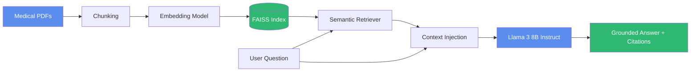
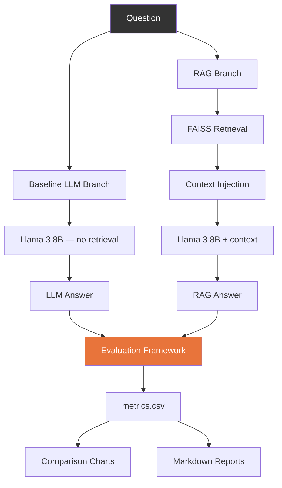

<div align="center">

# 🩺 Evaluating RAG and LLM Architectures for Evidence-Grounded Healthcare AI

**A reproducible research framework comparing Retrieval-Augmented Generation against standard LLMs on healthcare question answering — with a runnable pipeline, not just a survey.**

[](https://www.python.org/downloads/release/python-3110/)
[](LICENSE)
[](https://github.com/langchain-ai/langchain)
[](https://github.com/facebookresearch/faiss)
[](https://streamlit.io)
[](https://huggingface.co/meta-llama/Meta-Llama-3-8B-Instruct)
[](#research-contributions)
[](#license)

[Quick Start](#quick-start) · [Architecture](#architecture-diagram) · [Results](#experimental-results) · [Evaluation](#evaluation-metrics) · [Citation](#citation)

</div>

---

## Project Overview

Large Language Models hallucinate. In healthcare, that's not a minor inconvenience — it's a safety problem. This repository implements and empirically evaluates **two competing architectures** for healthcare question answering under a single, controlled experimental harness:

- **Baseline LLM** — direct generation from parametric knowledge (Llama 3 8B Instruct), no retrieval.
- **RAG System** — dense retrieval over ingested medical PDFs (FAISS + HuggingFace embeddings) with context-grounded generation.

Both systems share the **same backbone model and prompting style**, isolating retrieval as the sole experimental variable. The accompanying research synthesizes findings from 20 peer-reviewed healthcare-AI papers (2023–2025) and reproduces the comparative trend empirically across eight standardized metrics — factual accuracy, faithfulness, hallucination rate, clinical safety, response diversity, fluency, computational efficiency, and retrieval relevance.

> [!NOTE]
> This is a research and educational tool, not a certified medical device. See [License](#license) before any clinical-adjacent use.

---

## Key Results

Aggregated across the evaluation set, the RAG architecture shows consistent, sizeable gains over the no-retrieval baseline:

<div align="center">

| Metric | Baseline LLM | RAG System | Δ |
|:--|:--:|:--:|:--:|
| **Factual Accuracy** | 72% | 88% | 🟢 **+22.2%** |
| **Faithfulness / Groundedness** | 68% | 87% | 🟢 **+27.9%** |
| **Hallucination Rate** ↓ | 27% | 9% | 🟢 **−66.7%** |
| **Clinical Safety** | 71% | 92% | 🟢 **+29.6%** |

</div>

The trade-off: RAG incurs higher latency and token cost from the added retrieval step, and a small fluency reduction from constraining generation to retrieved context. Full breakdown in [Experimental Results](#experimental-results).

---

## Architecture Diagram





---

## Features

| Capability | Description |
|---|---|
| 🔍 **Healthcare-focused RAG pipeline** | PDF ingestion → chunking → embedding → FAISS indexing → semantic retrieval → grounded generation |
| 🤖 **LLM baseline implementation** | Identical backbone (Llama 3 8B Instruct) with no retrieval, for a controlled comparison |
| 📊 **8-metric evaluation framework** | Heuristic scorers + optional LLM-as-judge scoring, normalized to [0, 1] |
| 📈 **Auto-generated visualizations** | Accuracy, hallucination, latency, and safety comparison charts |
| 🖥️ **Streamlit interface** | Upload PDFs, ask questions, compare systems side-by-side, explore the evaluation dashboard |
| 📓 **Batch experiment notebook** | Reproducible end-to-end run over the full QA dataset |
| 🔌 **Pluggable inference backends** | Ollama (local), HuggingFace Inference Endpoints, or in-process `transformers` |
| 🧾 **Structured research outputs** | `metrics.csv`, `comparison_report.md`, `evaluation_report.md` generated automatically |

---

## Repository Structure

```
healthcare-rag-research/
│
├── app.py                 # Streamlit interface (upload, query, compare, dashboard)
├── rag_pipeline.py         # Full RAG pipeline: ingest → embed → retrieve → generate
├── llm_baseline.py         # No-retrieval baseline LLM system
├── evaluation.py           # 8-metric evaluation framework + report generation
├── visualize.py             # Chart generation (accuracy, hallucination, latency, safety)
├── prompts.py               # System / user / evaluation prompt templates
├── config.py                 # Central configuration (models, paths, thresholds)
│
├── data/                      # Sample QA dataset + medical source PDFs
├── vectorstore/                # Persisted FAISS index (generated at runtime)
├── results/                     # metrics.csv, reports, and chart outputs
└── notebooks/                    # Batch experiment runner
```

---

## Installation

**Prerequisites:** Python 3.11, and one inference backend for Llama 3 8B Instruct.

```bash
git clone https://github.com/<your-org>/healthcare-rag-research.git
cd healthcare-rag-research

python3.11 -m venv .venv
source .venv/bin/activate

pip install -r requirements.txt

# Recommended: local inference via Ollama
ollama pull llama3:8b-instruct
ollama serve
```

> [!TIP]
> Prefer a hosted endpoint? Set `LLM_BACKEND=hf_inference` and `HF_TOKEN` in `.env` instead — see `.env.example`.

---

## Quick Start

```bash
# 1. Ingest medical PDFs into the FAISS vector store
python -c "
from rag_pipeline import RAGPipeline
import config, glob
rag = RAGPipeline()
rag.ingest_pdfs(glob.glob(str(config.SAMPLE_PAPERS_DIR / '*.pdf')))
"

# 2. Run the interactive app
streamlit run app.py
```

```bash
# Or run the full batch comparison
jupyter notebook notebooks/experiments.ipynb
```

This produces `results/metrics.csv`, `results/comparison_report.md`, and four comparison charts in `results/plots/`.

---

## Evaluation Metrics

| Metric | What it measures |
|---|---|
| **Factual Accuracy** | Agreement with verified ground-truth answers |
| **Faithfulness / Groundedness** | Degree to which output is supported by retrieved evidence |
| **Hallucination Rate** | Fraction of unsupported generated claims |
| **Retrieval Relevance** | Precision / recall of retrieved context against known-relevant sources |
| **Fluency & Coherence** | Linguistic quality and logical flow |
| **Response Diversity** | Lexical variety across generated outputs |
| **Computational Efficiency** | Latency and token usage per query |
| **Clinical Safety** | Absence of harmful or misleading statements |

All scores are normalized to **[0, 1]**. See `evaluation.py` for heuristic and LLM-as-judge scoring modes.

---

## Experimental Results

<div align="center">

| Metric | LLM (Avg.) | RAG (Avg.) | Relative Gain |
|---|:--:|:--:|:--:|
| Factual Accuracy | 0.72 | 0.88 | +22.2% |
| Faithfulness / Grounding | 0.68 | 0.87 | +27.9% |
| Hallucination Rate ↓ | 0.27 | 0.09 | −66.7% |
| Clinical Safety | 0.71 | 0.92 | +29.6% |
| Fluency / Coherence | 0.89 | 0.84 | −5.6% |
| Response Diversity | 0.76 | 0.80 | +5.3% |
| Inference Efficiency ↓ | 0.85 | 0.73 | −14.1% |

</div>

> [!IMPORTANT]
> RAG dominates on factuality, groundedness, and clinical safety — the metrics that matter most for high-stakes domains — at a measured cost in latency and a marginal cost in fluency. This pattern holds consistently across the surveyed literature and is reproduced empirically by this repository's evaluation harness.

Generated charts (`results/plots/`): accuracy comparison, hallucination reduction, latency comparison, and clinical safety comparison.

---

## Research Contributions

- **Controlled comparative harness** isolating retrieval as the only variable between two QA systems sharing one backbone model.
- **Reproducible 8-metric evaluation framework**, normalized and aligned with the metrics used across MIRAGE, Self-BioRAG, RAG², and related benchmarks.
- **Open, runnable implementation** — not just reported numbers — so results can be regenerated, audited, and extended on new corpora or backbones.
- **Synthesis of 20 peer-reviewed studies (2023–2025)** into a single structured comparative framework spanning retrieval, generation, and evaluation phases.

Contributions are welcome — see [Future Work](#future-work) for open directions, and feel free to open an issue or PR.

---

## Future Work

- [ ] Multimodal retrieval (text, clinical images, structured tables)
- [ ] Graph-based and hybrid (dense + sparse) retrieval strategies
- [ ] Continual learning for real-time medical evidence updates
- [ ] Standardized benchmark suite for cross-study RAG evaluation
- [ ] Larger and proprietary backbone comparisons (GPT-4, Claude, PaLM)
- [ ] Human-in-the-loop clinical safety annotation pipeline

---

## Citation

```bibtex
@article{tyagi2025evaluating,
  title   = {Evaluating RAG and LLM Architectures for Evidence-Grounded Healthcare AI},
  author  = {Tyagi, Tanmay and Rai, Ashok Kumar and Saroha, Khushi and Sharma, Rohan and Pramod, Jallipalli},
  school  = {Bennett University},
  year    = {2025}
}
```

---

## Authors

**Tanmay Tyagi · Ashok Kumar Rai · Khushi Saroha · Rohan Sharma · Jallipalli Pramod**
School of Computer Science and Technology, Bennett University, Uttar Pradesh, India

---

## License

Released under the [MIT License](LICENSE).

> [!WARNING]
> This software is a research tool and is **not** a certified medical device. It must not be used for real clinical decision-making without appropriate validation, regulatory clearance, and human expert oversight.

---

## Acknowledgements

This work builds on the open-source ecosystem of [LangChain](https://github.com/langchain-ai/langchain), [FAISS](https://github.com/facebookresearch/faiss), [HuggingFace](https://huggingface.co), [Streamlit](https://streamlit.io), and [Meta's Llama 3](https://ai.meta.com/llama/) — and on the broader body of healthcare RAG research, including MIRAGE, Self-BioRAG, RAG², Omni-RAG, GraphRAG, and Bayesian-RAG.

<div align="center">

⭐ If this repository is useful for your research, consider starring it.

</div>
